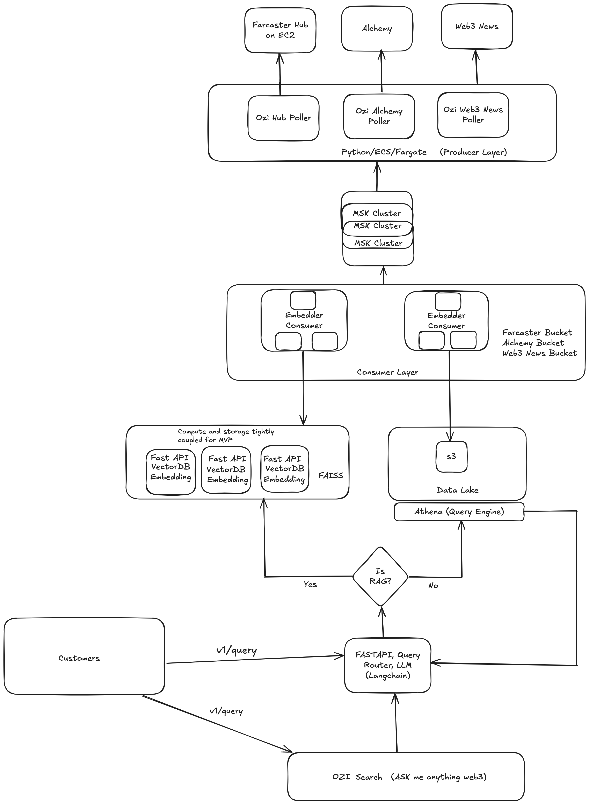

# Ozi 🧠📡

**Ozi** is an open-source real-time semantic search and analytics engine for decentralized social networks, starting with [Farcaster](https://www.farcaster.xyz).

It streams casts, comments, and reactions from live events, embeds them for semantic retrieval, and stores structured event data for analytic SQL queries all powered by Kafka, DuckDB, FAISS, and LLMs.





---

## ⚙️ Architecture Overview

| Component | Description |
|-----------|-------------|
| **Kafka Producers** | Poll and publish Farcaster events into Kafka topics |
| **Kafka Consumers** | Consume events and write structured data into DuckDB and Chroma/FAISS |
| **DuckDB** | Fast OLAP database for time-windowed, relational, and analytic queries |
| **Vector Database (Chroma/FAISS)** | Stores text embeddings for semantic search |
| **FastAPI Server** | Serves APIs for semantic search and structured analytics |
| **LLM Service (ChatGPT / Ollama)** | Classifies user queries and generates SQL if needed |
| **RAG Layer** | Powers retrieval-augmented generation over event streams |


## ⚡ System Guarantees

Ozi's data ingestion and analytics pipeline is designed to prioritize:

---

### 1. High Availability (HA)

- The Kafka analytics consumer is built to **restart automatically** after crashes or restarts.
- Messages are consumed **continuously** and **buffers are flushed** to DuckDB on normal exit or crash recovery.
- If the consumer goes down temporarily, it will **reconnect and resume** from the latest Kafka offset without loss.

---

### 2. Reliability

- **At least once processing**: Kafka guarantees messages are delivered at least once to the consumer.
- **Idempotent writes**: All inserts into DuckDB use `ON CONFLICT(id) DO NOTHING` to prevent duplication in the database.
- **Crash-safe ingestion**: Buffered records are written immediately to disk after bulk insertion to DuckDB.
- **Bulk insertion**: Records are inserted in efficient batches for speed and to minimize memory usage.

---

### 3. Eventual Consistency

- Ozi is designed to be **eventually consistent**:  
  All valid Farcaster events (casts, comments, reactions) will eventually appear in DuckDB.
- **Small ingestion delays are acceptable** in favor of higher throughput and system resilience.
- Queries reflect **near-real-time data** under normal operation.

---

### 4. System Principles

| Principle | How Ozi Achieves It |
|:---|:---|
| High Availability | Consumer automatically reconnects to Kafka after crashes. |
| Reliable Ingestion | Idempotent inserts into DuckDB, no duplicates even under retries. |
| Eventual Consistency | Message arrival order is not strictly enforced; data is ingested reliably over time. |
| Efficient Batching | Messages are buffered by type and bulk inserted to DuckDB. |
| Graceful Degradation | If traffic spikes, consumers process with slight delay without dropping data. |
| Minimal Operator Overhead | Self-healing consumer design with automatic reconnection and flush logic. |

---

## 📦 Microservices and Components

- **analytics/** — DuckDB management, analytic query services
- **rag/** — Semantic search APIs, RAG services
- **consumers/** — Kafka consumers writing structured events
- **producers/** — Kafka pollers (optional, for testing/local ingestion)
- **llm/** — Pluggable LLM layer (ChatGPT for now, Ollama later)
- **services/** — Search orchestration and query generation
- **utils/** — Shared utilities (e.g., SQL validator)
- **models.py** — Pydantic models for API requests/responses
- **main.py** — FastAPI app wiring and router mounting

---
## ⚡ Data Flow

```plaintext
Kafka Producer → Kafka Topic (casts/comments/reactions)
Kafka Consumer → Writes to DuckDB + Vector DB
FastAPI → /search → LLM classifies → (Semantic search OR SQL generation)
FastAPI → /query → Stream full analytic query results


## 🧪 Use Cases & Example Queries

Ozi lets you explore Farcaster activity in real-time whether you're a researcher, builder, or curious user.

**Use Cases (WIP):**
- Query Casts via natural language
- Run custom analytics on Farcaster events
- Build dashboards or agents over social data
- Warpcast-integrated search and summarization

---

### 🧠 Ask Anything

You can interact with Ozi using natural language or SQL. The LLM will translate your questions into queries against the analytics engine. The UI layer will paginate the results (top 5).

**Try asking:**
- _"Which Farcaster users mentioned “Ethereum” the most this week?"_
- _"What are the top topics being discussed about Solana today?"_
- _"Show me all users who cast about tariffs in the last 7 days."_

**Example SQL generated:**

```sql
SELECT 
  user_id, 
  COUNT(*) AS cast_count
FROM casts
WHERE text ILIKE '%tariff%'
  AND timestamp >= NOW() - INTERVAL '7 days'
GROUP BY user_id
ORDER BY cast_count DESC
LIMIT 10;
```

**Example Analytics API Call:**
```
curl -X POST http://localhost:8000/query \
  -H "Content-Type: application/json" \
  -d '{
        "query": "SELECT user_id, COUNT(*) AS cast_count FROM casts WHERE text ILIKE ''%tariff%'' AND timestamp >= NOW() - INTERVAL ''7 days'' GROUP BY user_id ORDER BY cast_count DESC LIMIT 10;"
      }'
```
---

## 🛠️ Technologies Used

- **[FastAPI](https://fastapi.tiangolo.com/)** — High-performance Python web framework for building APIs
- **[DuckDB](https://duckdb.org/)** — Fast OLAP database for analytical queries on structured data
- **[Kafka](https://kafka.apache.org/)** — Distributed event streaming platform for ingesting real-time events
- **[Chroma](https://docs.trychroma.com/)** / **[FAISS](https://github.com/facebookresearch/faiss)** — Vector databases for semantic search over cast embeddings
- **[Sentence-Transformers](https://www.sbert.net/)** — Text embedding models for semantic similarity search
- **[OpenAI / ChatGPT APIs](https://platform.openai.com/)** — Language model service for query classification and SQL generation
- **[Docker + Docker Compose](https://docs.docker.com/compose/)** — Containerization and local orchestration of services


## 🛠️ Project Status

> Ozi is in early WIP. We’re building in public and welcoming feedback.

- ✅ Kafka ingestion
- ✅ Embedder master for LLM-based indexing
- ✅ Query API (FastAPI)
- 🧩 Historical Data Naynar
- 🧩 Analytics / dashboarding
- 🧩 Warpcast frame integration
- 🧩 Token/gov idea experiments

---

## 📖 API Endpoints

| Method | Path | Purpose |
|--------|------|---------|
| `POST` | `/search` | Search semantic or analytic queries |
| `GET`  | `/query` | Stream full analytic query results |
| `GET`  | `/health` | Health check to verify API is running |
| `GET`  | `/debug` | Debug endpoint to inspect sample data |


## 🚀 Getting Started

#### 1. Clone and install dependencies

```bash
git clone https://github.com/ashnet16/ozi.git
cd ozi
pip install -r requirements.txt
```

#### 2. Spin up Kafka

```
docker compose up -d

```

#### 3. Run the Farcaster Poller

```
python3 -m ozi.producers.pollers
```

OPTIONAL: Run in the background

```
nohup python3 -m ozi.producers.pollers > pollers.log 2>&1 &

```

#### 4. Start the Ozi API and databases 

```
docker-compose up -d

```

#### 5. Start the Consumer Service

```
python3 -m ozi.consumers.consumers

```

OPTIONAL: Run in the background

```
nohup python3 -m ozi.consumers.consumers > consumers.log 2>&1 &
```


#### Below are the Kafka Topics

```
kafka-topics --bootstrap-server localhost:9092 \
  --create --topic farcaster.cast.add --partitions 1 --replication-factor 1

kafka-topics --bootstrap-server localhost:9092 \
  --create --topic farcaster.events.other --partitions 1 --replication-factor 1

kafka-topics --bootstrap-server localhost:9092 \
  --create --topic farcaster.events.dlq --partitions 1 --replication-factor 1
```

#### Consume inside the container
```
kafka-console-consumer \
  --bootstrap-server localhost:9092 \
  --topic farcaster.events.add \
  --from-beginning \
  --property print.key=true \
  --property print.value=true

```

## 🚀 Future Improvements
- Introduce local LLM support via Ollama for faster, lower-cost inference
- Enable materialized views for trending topics and analytics rollups
- Add periodic incremental Z-Order clustering for optimizing DuckDB storage
- Expand multi-language support for semantic search and querying
- Build historical backfill service using Neynar APIs for full Farcaster event history
- Support background jobs for refreshing vector embeddings over time
- Add streaming aggregation (live trending topics, leaderboards)
- Explore distributed ingestion pipelines (scaling Kafka consumers and DuckDB writers)
- Optimize hot paths with either Rust or Go as we scale
- Add graceful shutdown handlers (`SIGINT`, `SIGTERM`) to flush all in-memory buffers during container shutdown.
- Track ingestion speed and Kafka consumer lag for observability.
- Horizontal scaling: allow partitioned Kafka topics and multiple analytics consumers for high throughput.

